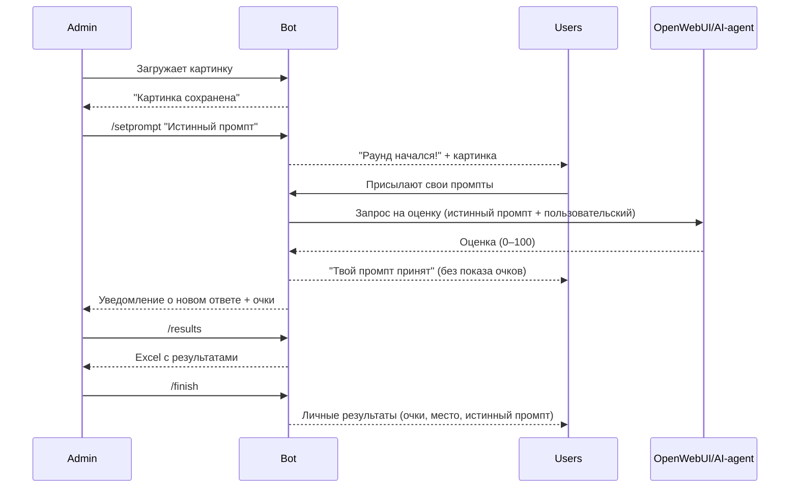

# 🥊 Битва промптов (Telegram Bot MVP)

Небольшой MVP-бот для игры "Битва промптов".  
Участникам показывается картинка, и они должны угадать, какой промпт использовался для её генерации.  

## 🚀 Возможности

- Админ загружает картинку и задаёт истинный промпт.
- Всем пользователям рассылается картинка → начинается раунд.
- Пользователи присылают свои версии промпта.
- Каждый ответ получает автоматическую оценку (в этой версии — случайное число от 0 до 100).
- Админ может выгрузить результаты в **Excel** (ник, промпт, очки).
- По завершению раунда бот рассылает каждому игроку его результат + истинный промпт.

## 🛠️ Технологии

- [python-telegram-bot](https://python-telegram-bot.org/)
- [openpyxl](https://openpyxl.readthedocs.io/)
- Python 3.10+
- (опционально) [Ollama](https://ollama.com/) для оценки схожести промптов

## ⚡ Установка и запуск

1. Установите зависимости:
```bash
pip install python-telegram-bot openpyxl
```

2. Вставьте свой Telegram Bot Token:

```python
TOKEN = "ВАШ_ТОКЕН"
ADMIN_ID = 123456789  # ваш user id (узнать можно в @userinfobot)
```

3. Запустите бота:

```bash
python bot.py
```

## 📖 Команды

* `/start` — приветствие (для игроков и админа разные).
* Загрузить картинку (админ).
* `/setprompt <текст>` — установить истинный промпт и начать раунд.
* Прислать сообщение (игрок) — засчитывается как промпт.
* `/results` — выгрузить Excel с результатами.
* `/finish` — завершить раунд, разослать результаты игрокам.

## 📊 Процесс игры



## 📦 Пример Excel

| ник     | предложенный промпт        | очки |
| ------- | -------------------------- | ---- |
| user123 | a cat sitting on the table | 78   |
| anna    | kitten on wooden desk      | 65   |
| ivan    | dog in the park            | 12   |

---

## ✅ Дальнейшие улучшения

* Подключить **Ollama/LLM** вместо случайной оценки.
* Поддержка **нескольких параллельных раундов**.
* Автоподсчёт победителей.
* Хранение результатов в БД или Google Sheets.
